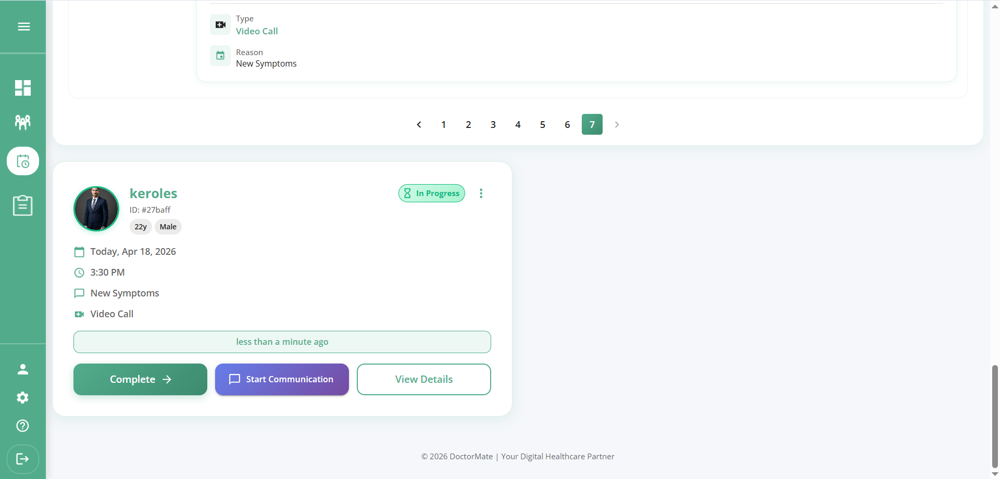
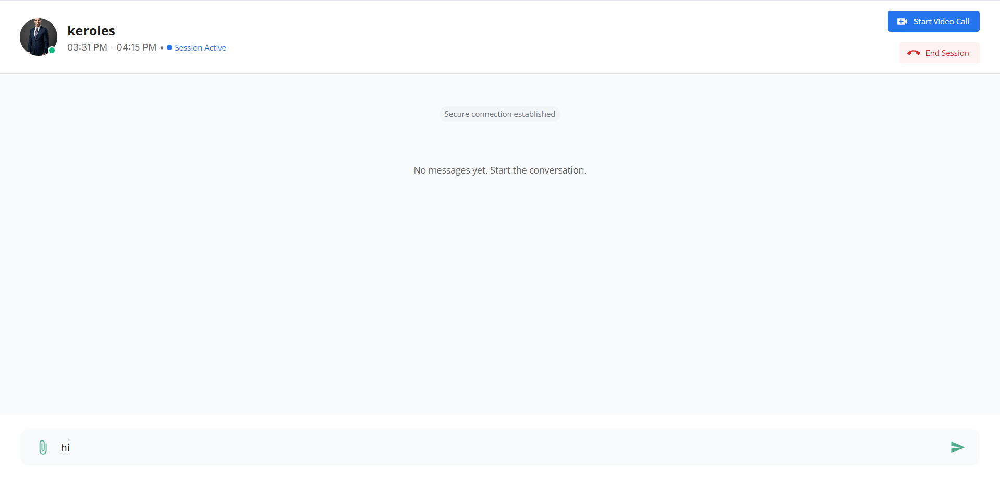

# 🏥 DoctorMate Doctor Dashboard

> **A Professional Web Dashboard for Healthcare Professionals**
>
> Manage appointments, communicate with patients, and conduct teleconsultations seamlessly with real-time technologies.

[](https://react.dev)
[](https://firebase.google.com)
[](https://www.agora.io)
[](LICENSE)

---

## 📋 Table of Contents

- [Project Overview](#-project-overview)
- [Demo](#-demo)
- [Key Features](#-key-features)
- [Communication & Telemedicine](#-communication--telemedicine)
- [Architecture & Project Structure](#-architecture--project-structure)
- [Tech Stack](#-tech-stack)
- [Getting Started](#-getting-started)
- [Environment Variables](#-environment-variables)
- [UI/UX Design](#-uiux-design)
- [License](#-license)
- [Team](#-team)

---

## 🚀 Project Overview

**DoctorMate Doctor Dashboard** is a comprehensive web application designed specifically for healthcare professionals. It's part of the DoctorMate healthcare ecosystem that connects doctors with patients through an integrated platform.

### Key Capabilities:

- 👨‍⚕️ Manage patient profiles and medical history
- 📅 Handle appointment scheduling and tracking
- 💬 Real-time chat with patients
- 🎥 Conduct secure video consultations
- 🔔 Receive instant notifications for appointments and messages
- 📱 Responsive design for desktop and tablet access,mobile

---

## 🎬 Demo

### 📺 Live Demo

[Visit Live Dashboard](https://doctor-mate.vercel.app)

### 🎥 Video Demo

[Watch Demo Video](https://drive.google.com/drive/folders/1RPl_hXdpCpJS6VFwO2kE50XCY9A3lf9_?usp=sharing)

## 📸 Screenshots

|                                                             |                                                             |                                                             |                                                             |
| ----------------------------------------------------------- | ----------------------------------------------------------- | ----------------------------------------------------------- | ----------------------------------------------------------- |
|  |  |  |  |

---

|                                                             |                                                             |                                                             |                                                             |
| ----------------------------------------------------------- | ----------------------------------------------------------- | ----------------------------------------------------------- | ----------------------------------------------------------- |
|  |  |  |  |

---

|                                                             |                                                             |                                                             |                                                             |
| ----------------------------------------------------------- | ----------------------------------------------------------- | ----------------------------------------------------------- | ----------------------------------------------------------- |
|  |  |  |  |

---

|                                                             |                                                             |                                                             |                                                             |
| ----------------------------------------------------------- | ----------------------------------------------------------- | ----------------------------------------------------------- | ----------------------------------------------------------- |
|  |  |  |  |

---

|                                                         |                                                         |                                                         |     |
| ------------------------------------------------------- | ------------------------------------------------------- | ------------------------------------------------------- | --- |
|  |  |  |

## ✨ Key Features

### 🔐 Authentication & Security

- **Secure Login/Registration** - Email and password-based authentication via Firebase Auth
- **Role-Based Access Control** - Dedicated doctor-specific features and restrictions
- **Session Management** - Auto-logout and session timeout for security
- **HIPAA Compliance** - Adherence to healthcare data protection standards

### 👥 Dashboard & Patient Management

- **Patient Directory** - View all patients with search and filter capabilities
- **Patient Profiles** - Comprehensive patient information including medical history
- **Medical Records** - Secure storage and access to patient documents
- **Patient Analytics** - Track consultation frequency and patient health trends
- **Quick Actions** - Fast access to schedule appointments or start consultations

### 📅 Appointment Management

- **Schedule Appointments** - Create and manage patient appointments
- **Calendar View** - Visual representation of daily and weekly schedules
- **Appointment Reminders** - Automated notifications for upcoming consultations
- **Reschedule/Cancel** - Flexible appointment modification options
- **Appointment History** - Track past consultations and follow-ups
- **Availability Settings** - Define working hours and break times

### 💬 Real-time Chat (Firebase Firestore)

- **Instant Messaging** - Send and receive messages in real-time
- **Typing Indicators** - See when patients are typing
- **Message History** - Access complete chat conversation history
- **File Sharing** - Share medical documents and prescriptions
- **Chat Notifications** - Push notifications for new messages
- **Message Search** - Search through past conversations

### 🎥 Voice & Video Calls (Agora RTC)

- **HD Video Calls** - Crystal clear 1080p video consultations
- **Audio-Only Mode** - Switch to audio-only for bandwidth optimization
- **Call Quality Indicators** - Monitor connection quality in real-time
- **Automatic Fallback** - Graceful degradation for poor connections

### 🔔 Notifications (Firebase Cloud Messaging)

- **Appointment Alerts** - Reminders for upcoming consultations
- **Message Notifications** - Alert for new patient messages
- **Missed Call Alerts** - Notify when patients initiate calls
- **System Notifications** - Important platform updates and alerts
- **Customizable Preferences** - Configure notification settings

### 📋 Medical Records

- **Prescription Management** - Create and send digital prescriptions
- **Document Storage** - Secure cloud storage for patient documents
- **Lab Results** - View and share laboratory test results
- **Diagnosis History** - Maintain detailed diagnosis records
- **Report Generation** - Export consultation reports in PDF format

---

## 📞 Communication & Telemedicine

### Agora Real-time Communication Engine

The dashboard leverages **Agora Real-Time Communication (RTC)** platform to deliver:

- **Ultra-Low Latency** - Sub-100ms video and audio transmission
- **Global Network** - 200+ data centers worldwide for optimal routing
- **High Reliability** - 99.99% uptime SLA for critical healthcare communications
- **Scalability** - Support for thousands of concurrent consultations

### Microphone & Camera Controls

- 🎙️ **Mic Control** - Mute/unmute with instant visual feedback
- 📹 **Camera Control** - Enable/disable video with quality presets
- 🔊 **Audio Settings** - Speaker and microphone selection
- 🎚️ **Volume Control** - Adjust speaker and microphone volume
- 🎛️ **Audio Enhancement** - Noise cancellation and echo reduction options

---

## 🏗️ Architecture & Project Structure

### React Architecture Highlights

- **Functional Components** - React Hooks for state management and side effects
- **Custom Hooks** - Reusable logic hooks ( useCommunicationSession.js)
- **Context API** - Global state for user data and app settings
- **Redux Toolkit** - Centralized state management for complex operations
- **Service Layer** - Abstracted API calls and Firebase operations
- **Error Boundaries** - Graceful error handling and recovery

### Project Folder Structure

📁 dashpord_doctor/
├── 📁 public/
│   ├── 📁 assets/
│   │   ├── 📁 auth/
│   │   ├── 📁 dashboard/
│   │   ├── 📁 H&S/
│   │   ├── 📁 imageView/
│   │   ├── 📁 message/
│   │   ├── 📁 navBar/
│   │   ├── 📁 patitient/
│   │   ├── 📁 schudle/
│   │   ├── 📁 settings/
│   │   ├── IMG-0001-00001.dcm
│   │   └── react.svg
│   ├── 📁 imageRedme/
│   │   └── (screenshots)
│   └── vite.svg
├── 📁 src/
│   ├── 📁 auth/
│   │   ├── compeleteProfile.jsx
│   │   ├── forgetPass.jsx
│   │   ├── logIn.jsx
│   │   ├── Otp.jsx
│   │   ├── resetPass.jsx
│   │   └── signUp.jsx
│   ├── 📁 components/
│   │   ├── LogoutButton.jsx
│   │   ├── navBar.jsx
│   │   ├── GlobalSnackbar.jsx
│   │   └── ProtectedRoute.jsx
│   ├── 📁 hooks/
│   ├── 📁 pages/
│   ├── 📁 redux/
│   ├── 📁 services/
│   ├── 📁 utils/
│   ├── App.css
│   ├── App.jsx
│   ├── index.css
│   ├── main.jsx
│   └── theme.js
├── eslint.config.js
├── index.html
├── package.json
├── vercel.json
├── vite.config.js
└── README.md
---

## 🛠️ Tech Stack

| Category               | Technology                 |
| ---------------------- | -------------------------- |
| **Frontend Framework** | React 18.x                 |
| **Build Tool**         | Vite                       |
| **State Management**   | Redux Toolkit, Context API |
| **UI Library**         | Material-UI (MUI)          |
| **Styling**            | CSS-in-JS, Tailwind CSS    |
| **HTTP Client**        | Axios                      |
| **Real-time Chat**     | Firebase Firestore         |
| **Video Calling**      | Agora RTC SDK              |
| **Push Notifications** | Firebase Cloud Messaging   |
| **Routing**            | React Router v6            |
| **Form Handling**      | React Hook Form            |
| **Package Manager**    | npm                        |
| **Version Control**    | Git                        |

---

## 🚀 Getting Started

### Prerequisites

- **Node.js** - v16.x or higher
- **npm** - v8.x or higher (or yarn)
- **Git** - for version control
- **Firebase Account** - for backend services
- **Agora Account** - for video calling capabilities

### Installation Steps

#### 1. Clone the Repository

```bash
git clone https://github.com/doctormate/doctor-dashboard.git
cd doctor-dashboard
```

#### 2. Install Dependencies

```bash
npm install
# or
yarn install
```

#### 3. Configure Environment Variables

Create a `.env` file in the root directory (see [Environment Variables](#-environment-variables) section)

#### 4. Run Development Server

```bash
npm run dev
# or
yarn dev
```

The application will be available at `http://localhost:5173`

#### 5. Build for Production

```bash
npm run build
# or
yarn build
```

#### 6. Preview Production Build

```bash
npm run preview
# or
yarn preview
```

---

## 🎨 UI/UX Design

### Design Philosophy

- **Clean & Minimalist** - Intuitive interface with minimal distractions
- **Healthcare-Focused** - Professional aesthetic suitable for medical environment
- **Dark Mode** - Optional dark theme to reduce eye strain during long sessions
- **Accessibility** - WCAG 2.1 AA compliance for all users

### Responsive Design

- **Desktop** - Full-featured experience on screens 1024px and above
- **Tablet** - Optimized layout for 768px to 1024px screens
- **Mobile** - Essential features accessible on smaller screens (limited features)

### Real-time Updates

- **Instant Messages** - Chat messages appear immediately
- **Live Notifications** - Push notifications for new appointments and messages
- **Calendar Sync** - Appointments update in real-time across all views
- **Presence Indicators** - See when patients are online and available

---

## 📄 License

This project is licensed under the **MIT License** - see the [LICENSE](LICENSE) file for details.

---

## 👥 Team

**DoctorMate Team**

Developed with ❤️ for healthcare professionals and patient care.

### Support

For support, email doctormate630@gmail.com or open an issue on GitHub.

### Links

- 🌐 [Website](https://doctor-mate.vercel.app)
- 📧 [Email](doctormate630@gmail.com)
- 💼 [LinkedIn](https://www.linkedin.com/in/keroles-adel-08020b332/)

---

<div align="center">

**Made with ❤️ by DoctorMate Team**

⭐ If this project helped you, please consider giving us a star!

</div>
